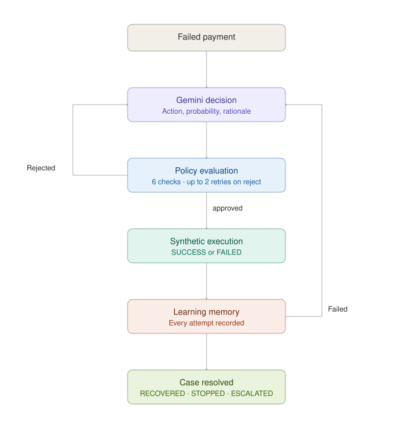

# Architecture

This document describes how the Revenue Recovery Strategy Optimizer is actually implemented — module boundaries, data model, and the exact decision/policy loop — as a companion to the README's high-level overview.

## Core Principle

Gemini proposes. It never has write access to a payment. Every proposal passes through a deterministic economic calculation and a deterministic policy gate before the synthetic payment provider executes anything.

## Pipeline Flow



## Request Lifecycle

A single failed payment enters through one of two API paths and both converge on the same pipeline:

- `POST /payments` (`app/api/payments.py`) — creates a payment via `PaymentSimulator`; on `FAILED`, builds a `RecoveryEventCreate` and calls the shared service.
- `POST /recovery-events` (`app/api/recovery_events.py`) — accepts a `RecoveryEventCreate` directly.

Both call `create_recovery_event_service` (`app/services/recovery_event.py`), which:

1. Checks for a duplicate `event_id` — if it already exists, returns the existing event/case as `"duplicate"` (idempotent ingestion).
2. Otherwise inserts a new `RecoveryEvent` and a `RecoveryCase` (`status="PENDING"`), commits, and calls `run_recovery_until_resolved`.

`run_recovery_until_resolved` (`app/services/recovery_pipeline.py`) repeatedly calls `run_recovery_pipeline` until the case reaches a terminal state:

- Outcome `SUCCESS` → `recovery_case.status = "RECOVERED"`, loop ends.
- A non-provider-execution result (Gemini's approved action was `STOP` or `ESCALATE`) → `recovery_case.status = "STOPPED"` or `"ESCALATED"`, loop ends.
- Outcome `FAILED` on a real provider action → loop runs again: a fresh `RecoveryContext` is loaded (now reflecting the failed attempt just recorded), and Gemini decides again.

`run_recovery_pipeline` itself is one decision cycle:

1. Load the current `RecoveryContext` (`recovery_context.py`).
2. Retrieve up to 3 relevant historical outcomes (`recovery_memory.py`) and pass them to Gemini as insights.
3. Ask Gemini for an action (`llm_decision.py`).
4. Compute `expected_net_recovery` for that action (`optimizer.py`).
5. Evaluate the action against 6 deterministic policy checks (`policy_engine.py`).
6. If rejected: record the reason, add it to `policy_feedback`, and re-prompt Gemini — up to 2 additional times (3 attempts total per cycle) — before giving up on this cycle.
7. If approved: execute against `PaymentProviderSimulator`, verify the outcome, write to `RecoveryLearningMemory` and `MerchantHistory`, commit.

## Module Map

| File                             | Responsibility                                                                                                                   |
| -------------------------------- | -------------------------------------------------------------------------------------------------------------------------------- |
| `services/recovery_event.py`     | Entry point — idempotent event ingestion, kicks off the pipeline                                                                 |
| `services/recovery_pipeline.py`  | Orchestrates one decision cycle and the outer resolve-until-terminal loop                                                        |
| `services/recovery_context.py`   | Assembles the bounded `RecoveryContext` Gemini sees, from DB rows                                                                |
| `services/llm_decision.py`       | Calls Gemini with a fixed system prompt, JSON schema, and `temperature=1.0`; validates the returned action is in the allowed set |
| `services/optimizer.py`          | Pure function: `predicted_p × amount − action_cost − risk_penalty`                                                               |
| `services/policy_engine.py`      | The 6 deterministic approval checks; the only place an action is actually authorized                                             |
| `services/recovery_memory.py`    | Retrieves diverse historical examples for Gemini; writes the outcome of every attempt afterward                                  |
| `services/recovery_metrics.py`   | Aggregates `RecoveryLearningMemory` into the live `/metrics/recovery` numbers                                                    |
| `services/recovery_dashboard.py` | Read model for the frontend — the most recent case's full decision/policy/execution/outcome view                                 |
| `simulator/payment_provider.py`  | Executes an approved action; returns `SUCCESS`/`FAILED`/`NOT_EXECUTED` (the latter for `STOP`/`ESCALATE`)                        |
| `simulator/ground_truth.py`      | Hidden probability model used to decide the _actual_ simulated outcome (Gemini never sees this)                                  |
| `simulator/baseline.py`          | A separate, simpler probability heuristic — stored alongside Gemini's prediction purely for calibration comparison               |
| `core/recovery_actions.py`       | The `RecoveryAction` enum plus each action's cost and risk penalty                                                               |
| `core/config.py`                 | Environment-driven settings (DB, Gemini key/model) via `pydantic-settings`                                                       |

## Data Model

```text
RecoveryEvent (1) ──── (1) RecoveryCase
     |                        status: PENDING → RECOVERED | STOPPED | ESCALATED
     |
MerchantContext ──── MerchantHistory (many, per case)
     |                   action, outcome, amount, intervention_cost
     |
PaymentHistory (customer's past payments, used to compute failure rate)

RecoveryLearningMemory (independent table — one row per resolved decision cycle)
     failure_code, failure_category, payment_method, action, outcome,
     llm_p_pred, gt_p, baseline_p, net_recovery_value, financial_impact
```

- **`RecoveryEvent` / `RecoveryCase`** — one case per failed payment; case status is the source of truth for pipeline resolution.
- **`MerchantContext`** — per-merchant policy configuration: `recovery_enabled`, `allowed_recovery_actions`, `retry_cooldown_seconds`, `max_recovery_attempts`.
- **`MerchantHistory`** — an append-only log of every executed action per case; `recovery_context.py` counts rows scoped to the current case to derive `recovery_attempt_count` and the most recent action/outcome/timestamp.
- **`RecoveryLearningMemory`** — the experience layer: every resolved cycle (including `STOPPED`/`ESCALATED`, tagged `financial_impact="NO_RECOVERY_ATTEMPT"`) is written here, and it's the sole source for both historical-insight retrieval and the `/metrics/recovery` aggregates.

## RecoveryContext — what Gemini actually sees

Built fresh on every decision cycle by `load_recovery_context`, from live DB state — never stale:

- `case` — case id, status, created_at
- `current_payment_failure` — amount, currency, failure code/category, payment method, attempt number
- `merchant` — recovery flags, allowed actions, cooldown, attempt limit
- `merchant_recovery_history` — this case's prior attempts (action/outcome/cost/timestamp) plus a derived `recovery_attempt_count`
- `customer_payment_history` — this customer's other payments with this merchant, plus a derived `customer_failure_rate`

Gemini receives exactly this object as JSON, plus `allowed_recovery_actions`, `historical_insights`, and `policy_feedback` — nothing else. It cannot see other merchants, other customers, or the ground-truth/baseline probability models.

## The Policy Retry Loop, precisely

Two separate anti-repetition mechanisms operate at different scopes:

- **Within one decision cycle**: `rejected_actions` is an in-memory set — if Gemini proposes an action already rejected earlier in this cycle, that's flagged in `policy_feedback` before re-evaluating.
- **Across cycles, in the policy engine itself**: check #5 rejects an action if it exactly matches `last_recovery_action` from `MerchantHistory` — i.e., you can't execute the same action twice in a row for a case, even across separate pipeline runs.

If all 3 attempts in a cycle are rejected, `run_recovery_pipeline` returns `(policy_decision, None)` with nothing executed. `run_recovery_until_resolved` treats a `None` simulation result as "nothing left to do this call" — the case is only moved to a terminal `STOPPED`/`ESCALATED` state when Gemini's _approved_ action is `STOP` or `ESCALATE`, not merely when retries are exhausted. In practice, since `ESCALATE`/`STOP` bypass the attempt-limit check, an exhausted case reliably converges to one of those on a subsequent cycle.

## Three Probabilities, Not One

The system deliberately keeps three probability values separate, so prediction quality is measurable rather than assumed:

| Probability            | Computed by                                                                                                                                                  | Purpose                                                                                              |
| ---------------------- | ------------------------------------------------------------------------------------------------------------------------------------------------------------ | ---------------------------------------------------------------------------------------------------- |
| `predicted_p_recovery` | Gemini                                                                                                                                                       | What the model believes; used in the economic calculation and policy gate                            |
| `gt_p` (ground truth)  | `simulator/ground_truth.py` — a deterministic formula over action, payment method, failure category, customer history, time-since-failure, and attempt count | Secretly decides the simulator's actual `SUCCESS`/`FAILED` roll — Gemini never sees this             |
| `baseline_p`           | `simulator/baseline.py` — a simpler heuristic (no failure-category or payment-method effects)                                                                | Stored for comparison only, to compute `baseline_error` alongside `llm_error` in `/metrics/recovery` |

## Recovery Memory Retrieval

`retrieve_recovery_memory` doesn't just return the most recent matches — it actively builds a diverse set of up to 3 examples: it prefers an exact match on failure code + payment method over a broader failure-category match, guarantees at least one `SUCCESS` example when available, caps `FAILED` examples at 2, and never returns two records with the same action. This is what's supplied to Gemini as `historical_insights`.

## API Surface

| Endpoint                      | Purpose                                                                                   |
| ----------------------------- | ----------------------------------------------------------------------------------------- |
| `POST /payments`              | Create a payment; on failure, runs it through the full recovery pipeline                  |
| `POST /recovery-events`       | Ingest a recovery event directly (idempotent on `event_id`)                               |
| `GET /recovery-events/latest` | Full decision/policy/execution/outcome view of the most recent case — backs the dashboard |
| `GET /metrics/recovery`       | Live aggregate metrics across every resolved case                                         |
| `GET /health`                 | Liveness check                                                                            |

## Configuration

Settings are loaded via `pydantic-settings` from `.env` (`app/core/config.py`): database connection, `GEMINI_API_KEY`, and `GEMINI_MODEL` (defaults to `gemini-3.5-flash`). `app/core/model_check.py` is a standalone utility script to list Gemini models the configured key has access to.

## Testing

See the README's Testing section for the full breakdown — 97 `unittest.TestCase`-based tests (run via `pytest`) across the policy engine, retry loop, LLM decision service, optimizer, memory, metrics, simulator, and API layers.
