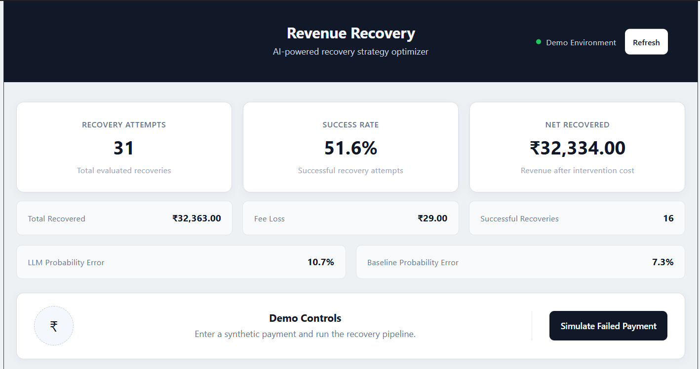
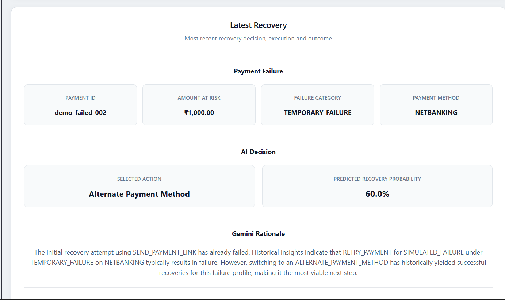
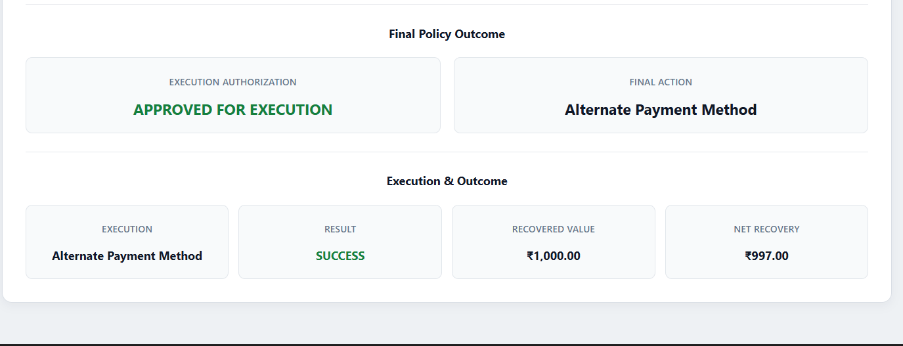

# Revenue Recovery Strategy Optimizer

An AI-powered revenue recovery system that turns failed payments into recovered revenue — Gemini recommends a recovery action, deterministic economic and policy layers approve or reject it, a synthetic payment environment executes it, and the outcome feeds back into a learning memory that improves future decisions.

**AI recommends. Deterministic systems control execution.**

## TL;DR

- Failed payment comes in → Gemini proposes a bounded recovery action (`RETRY_PAYMENT`, `ALTERNATE_PAYMENT_METHOD`, or `SEND_PAYMENT_LINK`) with a predicted recovery probability and rationale.
- The proposal is checked against deterministic **economic** and **policy** rules before anything executes — Gemini never touches a payment directly.
- An approved action runs against a synthetic payment simulator, the outcome is verified, and it's written into learning memory.
- **Memory works**: giving Gemini three past recovery outcomes for a similar case changed its decision from `RETRY_PAYMENT` (0.80 predicted) to `SEND_PAYMENT_LINK` (0.85 predicted) — see [Evaluation](#evaluation).
- Built with FastAPI + PostgreSQL on the backend, React + Vite on the frontend, Google Gemini for decisioning.

## Screenshots

**Dashboard — recovery metrics and lifecycle at a glance**



**Failed payment → AI decision — action, predicted probability, rationale**



**Policy + execution result — approved action and recovered value**



## Evaluation

**Question:** does historical recovery memory actually change what Gemini decides?

**Setup:** the same failed-payment context (a temporary UPI failure) was evaluated twice — once with no historical insights, once with three relevant past outcomes supplied.

| Metric              | Memory OFF      | Memory ON           |
| ------------------- | --------------- | ------------------- |
| Action              | `RETRY_PAYMENT` | `SEND_PAYMENT_LINK` |
| Predicted recovery  | 0.80            | 0.85                |
| Historical insights | None            | 3                   |

With memory on, Gemini explicitly reasoned from the supplied history:

- `SEND_PAYMENT_LINK` → `SUCCESS` / `POSITIVE_RECOVERY`
- `ALTERNATE_PAYMENT_METHOD` → `FAILED` / `FEE_LOSS`
- `RETRY_PAYMENT` → `FAILED` / `FEE_LOSS`

**Result:** the memory → decision feedback loop works as designed — supplying relevant history measurably changed both the chosen action and the model's confidence.

_Note: the simulator is stochastic and synthetic, so this demonstrates the feedback mechanism rather than real-world recovery lift._

## Quickstart

### Backend

```bash
python -m venv .venv
.\.venv\Scripts\Activate.ps1        # Windows PowerShell
python -m pip install -r requirements.txt
docker compose up -d                # start PostgreSQL
python -m scripts.verify_database
python -m uvicorn app.main:app --reload
```

Backend runs at `http://127.0.0.1:8000`.

### Frontend

```bash
cd frontend
npm install
npm run dev
```

### Configuration

Copy `.env.example` to `.env` and set:

```env
APP_NAME=Revenue Recovery Strategy Optimizer
APP_ENVIRONMENT=development

DATABASE_HOST=127.0.0.1
DATABASE_PORT=5432
DATABASE_NAME=revenue_recovery
DATABASE_USER=revenue_recovery
DATABASE_PASSWORD=local_development_password

GEMINI_API_KEY=
GEMINI_MODEL=gemini-3.5-flash
```

`VITE_API_BASE_URL` (frontend, optional) defaults to the local backend URL if unset.

### Tests

```bash
python -m pytest              # backend
npm run lint                  # frontend lint (from /frontend)
npm run build                 # frontend production build (from /frontend)
```

## How It Works

```text
Failed Payment
      |
      v
Recovery Context  ───────────────►  Gemini Decision
                                          |
                                          +-- Action
                                          +-- Predicted Recovery Probability
                                          +-- Rationale
                                          |
                                          v
                                  Economic Evaluation  ← expected value vs. transaction value
                                          |
                                          v
                                  Policy Evaluation     ← business rules, can reject any AI call
                                          |
                                          v
                                  Synthetic Execution   ← SUCCESS / FAILED
                                          |
                                          v
                                  Outcome Verification
                                          |
                                          v
                          Learning Memory  +  Recovery Metrics
```

Gemini receives a bounded `RecoveryContext`, the recovery actions allowed for that case, and optionally relevant historical recovery insights. It returns exactly:

```json
{
  "action": "ALTERNATE_PAYMENT_METHOD",
  "predicted_p_recovery": 0.6,
  "rationale": "The failure context indicates that an alternate payment method is a suitable recovery path."
}
```

That recommendation then passes through economic and policy checks — both of which can reject it — before anything reaches the synthetic execution layer.

### Recovery actions

| Action                     | Purpose                                                          |
| -------------------------- | ---------------------------------------------------------------- |
| `RETRY_PAYMENT`            | Retry the failed payment using the existing payment method       |
| `ALTERNATE_PAYMENT_METHOD` | Attempt recovery through an alternative payment method           |
| `SEND_PAYMENT_LINK`        | Payment-link style recovery attempt in the synthetic environment |

### Economic evaluation

Uses Gemini's predicted recovery probability together with transaction value and recovery economics to check the proposed action has sufficient expected value. Gemini proposes one candidate action; this layer evaluates it — it doesn't search the full action space itself.

### Policy evaluation

Applies deterministic business constraints on top of the economic check. A Gemini recommendation can be rejected here even when the economics look favorable.

### Learning memory

Every completed recovery attempt is stored with its action, predicted probability, ground-truth outcome, baseline probability, payment characteristics, failure category, financial impact, and attempt number — building the experience layer that the [evaluation above](#evaluation) draws on.

## Recovery Metrics

The dashboard tracks:

- Recovery success rate = successful recoveries / total recovery attempts
- Net recovered value = total recovered value − total fee loss
- LLM probability error = mean(abs(predicted − ground truth)), a calibration-style metric
- Baseline probability error, for comparison against the LLM
- Total recovery attempts, successful recoveries, total recovered value, total fee loss

## Project Structure

```text
Revenue_Recovevry_Software/
|
+-- app/
|   +-- api/            payments.py, recovery_events.py
|   +-- core/           config.py, database.py
|   +-- models/
|   +-- schemas/
|   +-- services/       recovery_context.py, recovery_decision.py,
|   |                   recovery_economics.py, recovery_event.py,
|   |                   recovery_memory.py, recovery_metrics.py,
|   |                   recovery_pipeline.py
|   +-- simulator/      payments.py
|   +-- main.py
|
+-- frontend/
|   +-- src/App.jsx
|   +-- package.json
|   +-- vite.config.js
|
+-- docs/
|   +-- screenshots/    dashboard.png, ai-decision.png, policy-execution.png
|
+-- scripts/            verify_database.py
+-- tests/
+-- docker-compose.yml
+-- requirements.txt
+-- .env.example
```

## Tech Stack

| Layer          | Stack                                                      |
| -------------- | ---------------------------------------------------------- |
| Backend        | Python, FastAPI, SQLAlchemy, PostgreSQL, Pydantic, Psycopg |
| AI             | Google Gemini (`google-genai`)                             |
| Frontend       | React, Vite, JavaScript, ESLint                            |
| Infrastructure | Docker Compose, PostgreSQL                                 |
| Testing        | Pytest, ESLint, Vite production build                      |

## Design Principles

- **AI recommends, systems decide.** Gemini never executes a payment or overrides policy — every recommendation passes through economic and policy gates first.
- **Bounded action space.** Gemini can only choose from the recovery actions the application permits for a given context.
- **Synthetic, not live.** The payment execution layer is a simulator, kept deliberately separate from real payment infrastructure.
- **Measurable by design.** Every recovery attempt is verified and logged, so predicted probability can be checked against ground truth and compared to a baseline.

## Demo Flow

1. Create a payment (₹1,000, CARD, outcome `SUCCESS`) — it succeeds and never enters recovery.
2. Create another (₹1,000, CARD, outcome `FAILED`) — it enters the recovery pipeline.
3. Gemini returns an action, predicted recovery probability, and rationale.
4. The action is checked against economic and policy rules; the dashboard shows the result.
5. An approved action runs through the synthetic simulator and returns `SUCCESS` or `FAILED`.
6. The outcome updates recovered value, fee loss, net recovered value, success rate, and learning memory.

This is a deliberately scoped vertical slice — failed payments as the initial recovery domain — built to show the full loop from AI recommendation to economic control, policy control, safe execution, verification, and measurable financial outcome.
